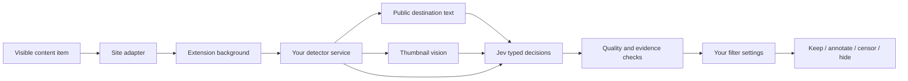

<p align="center">
  
</p>

<p align="center">
  <strong>An open-source browser extension that makes room for worthwhile content.</strong><br />
  Filter AI filler, clickbait, spam, and content-farm results. Keep the good stuff.
</p>

<p align="center">
  <a href="LICENSE"></a>
  
  
  <a href="CONTRIBUTING.md"></a>
</p>

<p align="center">
  <a href="#try-it-locally">Get started</a> · <a href="#how-it-works">How it works</a> · <a href="docs/DEPLOYMENT.md">Host it</a> · <a href="CONTRIBUTING.md">Contribute</a> · <a href="PRIVACY.md">Privacy</a>
</p>

## Your feed, with a higher standard

The internet still contains thoughtful writing, patient tutorials, useful replies, and things made with care. NO SLOP helps those things get through.

- **Two independent filters.** Poorly generated AI content and classic low-quality content, such as spam and content farms. AI use by itself is not a reason to filter.
- **Censor or hide.** Censor places a quiet stamp over a complete result, with a reason and a reveal button. Hide closes the space it occupied. Restore the whole page from the popup.
- **Context stays intact.** Paragraphs and discussions with dependent replies get a quality note instead of having their meaning removed.
- **Your thresholds, your exceptions.** Choose filter strength, enable individual sites, pause a domain, and control thumbnail and destination analysis.
- **A small amount of motion.** A stamp settles in; a hidden result gently leaves. Disable animation at any time. System reduced-motion settings take precedence.
- **A real detection service.** Jev makes typed decisions through OpenRouter. A separate vision model inspects thumbnail images because Jev itself is text-only.

<p align="center"></p>

**Status: 0.1.0, pre-release.** The extension and self-hosted detector are implemented. There is no public sponsored endpoint or browser-store listing in this repository yet. The free hosted edition is designed for an operator-funded server key; the key never ships to users. See the [verification record](docs/VERIFICATION.md) for what has actually been tested and what remains to qualify.

## Try it locally

You need **Node.js 24+**, npm, a Chromium browser, and an OpenRouter key for actual detection. The interface preview needs no key.

```sh
npm ci
npm run build
```

Create `.env` from `.env.example` if you do not have one already, and set `OPENROUTER_API_KEY`. Keep it on the server.

```sh
npm run server:dev
```

Open `chrome://extensions` (or `edge://extensions`), enable **Developer mode**, choose **Load unpacked**, and select the generated **`dist/`** directory. In the first-run settings, test the local detector connection, review the data-sharing choices, and enable content analysis. Refresh pages that were open before installation.

To work on the interface:

```sh
npm run dev
# http://127.0.0.1:5173 — settings and a clearly labeled interactive demo
```

The demo uses pre-labeled example content. Real website filtering happens in the installed extension. [Detailed deployment instructions](docs/DEPLOYMENT.md) cover Docker, HTTPS, the service token, extension origins, spending controls, and release gates.

## Site support

| Surface | What is inspected | What is filtered |
| --- | --- | --- |
| YouTube | Titles, available description snippets, actual thumbnails through vision | Recognized video/Shorts cards, community posts and comments |
| Google Search | Search preview plus public destination HTML when enabled and accessible | Complete recognized organic result cards |
| Instagram / Facebook / X | Visible captions, posts, comments and available context | Recognized whole post or comment containers |
| TikTok | Captions, available thumbnails and comments | Recognized video and comment cards |
| Reddit / forums | Posts, replies and public discussion context | Whole independent items; annotations where replies depend on them |
| Other websites | Semantic article/list items and longer paragraphs | Independent content cards or non-destructive paragraph notes |

Adapters cover specific markup, not a promise that every layout or account variation works. Unknown layouts are left alone. Video/audio playback is not transcribed. A thumbnail is evidence about the thumbnail, not a view of the entire video. Private messaging and known sensitive surfaces are excluded, but no generic extension can recognize every private page. Use domain exceptions for sensitive sites.

## How it works



The content script identifies bounded items and watches visible, newly loaded content. The background validates requests, checks consent and exceptions, and talks to the configured service. The server enriches public evidence and asks independent Jev questions about quality, synthetic artifacts, deceptive hooks, and sufficient context. Deterministic policy then applies the user's settings.

Unknown authorship is not invented. When quality is clearly poor but origin is unclear, filtering applies only when both categories are enabled. Uncertain quality and unavailable requested evidence stay visible. Reasons describe the rubric signals; they are not fabricated model reasoning.

The server validates model output, limits input sizes and concurrency, checks and pins public DNS for destination fetches, rechecks redirects, caches decisions temporarily, and persists a daily paid-call allowance. The browser does not execute model output or remote code. [Architecture](docs/ARCHITECTURE.md) · [Detector details and evaluation](docs/DETECTOR.md).

## Quality is measured, not declared

```sh
npm run check       # types, deterministic tests, extension + server builds
npm run eval:live -- --media  # authored live corpus plus image/destination checks
npm run eval:holdout         # separate follow-up set; also uses paid provider calls
```

Live evaluation results are committed in [`docs/evaluations/`](docs/evaluations/). These are small development examples, not a representative benchmark or an AI-authorship test. False positives matter: a tool that removes good work has failed its purpose. Contributions should expand the evaluation set across languages and real, consented examples, with clear labels and counterexamples.

## Build this with us

The most useful contributions are often small: a changed selector, a false positive, a better translated example, or a keyboard interaction that could be clearer.

Read [CONTRIBUTING.md](CONTRIBUTING.md), then open a focused issue or pull request. Issue templates cover broken behavior and detection mistakes. Maintainer help is welcome as the project grows. If the project is useful to you, a star helps others find it.

| Area | Start here |
| --- | --- |
| Website adapters and context preservation | `src/content/` |
| Filtering policy, schemas and privacy guards | `src/shared/` |
| Popup, settings and interactive demo | `src/ui/` |
| Secure browser transport | `src/background/` |
| Jev, vision and destination inspection | `server/` |
| Regressions and live evaluation | `tests/`, `scripts/evaluate.ts` |

## Privacy and license

Hosted analysis is opt-in. Read the [privacy document](PRIVACY.md) before enabling it. For vulnerabilities, read [SECURITY.md](SECURITY.md). The service operator must publish their actual contact details, hosting practices, and provider disclosures before public launch.

NO SLOP is licensed under [AGPL-3.0-only](LICENSE). Modified network-hosted versions must meet the license's source-sharing requirements. Jev and the selected vision models are external services with their own terms; they are not bundled or relicensed by this project.

The interface uses [Radix Themes](https://www.radix-ui.com/themes) and locally packaged [Inter](https://rsms.me/inter/). Their MIT and SIL Open Font licenses are included in [`public/licenses/`](public/licenses/) and the extension build. See the [design guide](docs/DESIGN.md) for interface conventions.

Built with [TypeSafe Jev](https://docs.typesafe.ai/concepts/system-one), [OpenRouter](https://openrouter.ai/~typesafe/jev-latest), TypeScript, React, and Manifest V3.
