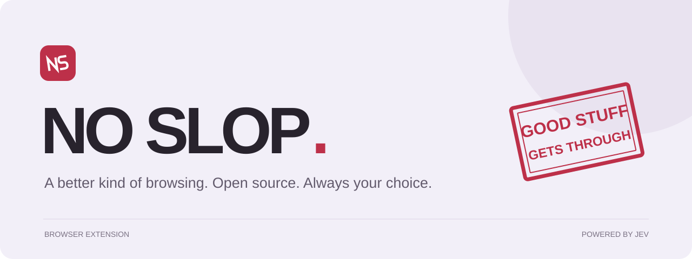
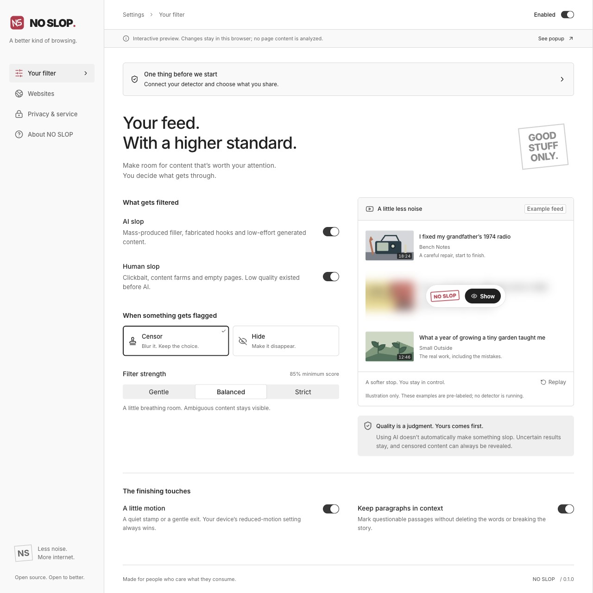
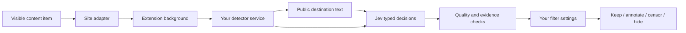

<p align="center">
  
</p>

<p align="center">
  <strong>An open-source browser extension that makes room for worthwhile content.</strong><br />
  Filter AI filler, clickbait, spam, and content-farm results. Keep the good stuff.<br />
  <strong>Developer preview. Bring your own key. Build it with us.</strong>
</p>

<p align="center">
  <a href="LICENSE"></a>
  <a href="https://github.com/juztripper/no-slop/releases/tag/v0.1.0"></a>
  <a href="https://github.com/juztripper/no-slop/actions/workflows/ci.yml"></a>
  
  
  <a href="https://github.com/juztripper/no-slop/blob/main/CONTRIBUTING.md"></a>
</p>

<p align="center">
  <a href="https://github.com/juztripper/no-slop/releases/tag/v0.1.0">Download preview</a> · <a href="#try-it-locally">Get started</a> · <a href="docs/DEPLOYMENT.md">Bring your own key</a> · <a href="CONTRIBUTING.md">Contribute</a>
</p>

**We are looking for contributors.** Help make site adapters reliable, catch false positives, add multilingual examples, or improve accessibility. The interface preview and deterministic tests need no API key. [Choose a first contribution →](CONTRIBUTING.md)

**Developer preview · 0.1.0.** Bring your own OpenRouter key and run the detector on your computer or a server you control. You pay your own provider usage; the project does not supply a hosted detector or shared key. Install the extension unpacked in Chrome or Edge. See the [release notes](https://github.com/juztripper/no-slop/releases/tag/v0.1.0) and [verification record](docs/VERIFICATION.md) for what has been tested.

## Your feed, with a higher standard

The internet still contains thoughtful writing, patient tutorials, useful replies, and things made with care. NO SLOP helps those things get through.

- **Two independent filters.** Poorly generated AI content and classic low-quality content, such as spam and content farms. AI use by itself is not a reason to filter.
- **Censor or hide.** Censor softly blurs the original content, with a small stamp and reveal control that adapt to the result's size and light or dark surface. Hide closes the space it occupied. Restore the whole page from the popup.
- **Context stays intact.** Paragraphs and discussions with dependent replies get a quality note instead of having their meaning removed.
- **Your thresholds, your exceptions.** Choose filter strength, enable individual sites, pause a domain, and control destination analysis.
- **A small amount of motion.** A stamp settles in; a hidden result gently leaves. Disable animation at any time. System reduced-motion settings take precedence.
- **Text-only detection.** Jev makes typed decisions through OpenRouter using titles, captions, snippets and context. Images are not fetched or analyzed.

<p align="center"></p>

## Try it locally

You need **Node.js 24+**, npm, and Chrome or Edge. Actual detection also needs **your own OpenRouter key and paid provider credits**. Building, running the interface preview, and deterministic tests need no key.

```sh
git clone https://github.com/juztripper/no-slop.git
cd no-slop
npm ci
npm run build
```

Copy `.env.example` to `.env` if you do not have one already, and set `OPENROUTER_API_KEY` to your own key. Keep the file local; never put this key in extension settings. Set a spending limit on the provider key and adjust `DAILY_CALL_BUDGET` for your usage. Then start your detector and leave this terminal running:

```sh
npm run server:dev
```

Open `chrome://extensions` (or `edge://extensions`), enable **Developer mode**, choose **Load unpacked**, and select the generated **`dist/`** directory. In the first-run settings, test the local detector connection, review the data-sharing choices, and enable content analysis. Refresh pages that were open before installation.

**Using a release ZIP?** [Download the extension](https://github.com/juztripper/no-slop/releases/download/v0.1.0/no-slop-0.1.0-chromium.zip), extract it into a permanent folder and load that folder instead of `dist/`. The ZIP contains the extension, not a detector or an API key. You still need the source checkout and local detector setup above. [Checksums](https://github.com/juztripper/no-slop/releases/download/v0.1.0/SHA256SUMS) · [Step-by-step setup and troubleshooting](docs/DEPLOYMENT.md).

After rebuilding, reload NO SLOP on the extensions page, then refresh your open feed tabs to load the new content script. An extension reload invalidates scripts already running in those tabs; they stop scanning and restore content when the lost connection is detected. Chrome keeps previously recorded errors until you clear them.

To work on the interface:

```sh
npm run dev
# http://127.0.0.1:5173 — settings and a clearly labeled interactive demo
```

The demo uses pre-labeled example content. Real website filtering happens in the installed extension. [Detailed deployment instructions](docs/DEPLOYMENT.md) cover Docker, HTTPS, the service token, extension origins, spending controls, and release gates.

## Site support

| Surface | What is inspected | What is filtered |
| --- | --- | --- |
| YouTube | Titles, available description snippets and comment text | Recognized video/Shorts cards, community posts and comments |
| Google Search | Search preview plus public destination HTML when enabled and accessible | Complete recognized organic result cards |
| Instagram / Facebook / X | Visible captions, posts, comments and available context | Recognized whole post or comment containers |
| TikTok | Captions and comments | Recognized video and comment cards |
| Reddit / forums | Posts, replies and public discussion context | Whole independent items; annotations where replies depend on them |
| Other websites | Semantic article/list items and longer paragraphs | Independent content cards or non-destructive paragraph notes |

Adapters cover specific markup, not a promise that every layout or account variation works. Unknown layouts are left alone. Images are ignored and video/audio playback is not transcribed. Claims appearing only inside a thumbnail cannot affect the decision. Private messaging and known sensitive surfaces are excluded, but no generic extension can recognize every private page. Use domain exceptions for sensitive sites.

## How it works



The content script identifies bounded items and watches visible, newly loaded content. The background validates requests, checks consent and exceptions, and talks to the configured service. The server enriches public evidence and asks independent Jev questions about quality, synthetic artifacts, deceptive hooks, and sufficient context. Deterministic policy then applies the user's settings.

Unknown authorship is not invented. When quality is clearly poor but origin is unclear, filtering applies only when both categories are enabled. Uncertain quality stays visible. If a destination cannot be fetched, only its available preview is judged; the failure itself is never a quality signal. Reasons describe the rubric signals; they are not fabricated model reasoning.

The server validates model output, limits input sizes and concurrency, checks and pins public DNS for destination fetches, rechecks redirects, caches decisions temporarily, and persists a daily paid-call allowance. The browser does not execute model output or remote code. [Architecture](docs/ARCHITECTURE.md) · [Detector details and evaluation](docs/DETECTOR.md).

## Quality is measured, not declared

```sh
npm run check       # types, deterministic tests, extension + server builds
npm run eval:text            # 40 authored text contrasts; paid Jev calls
npm run eval:live            # original development corpus; paid Jev calls
npm run eval:holdout         # separate follow-up set; also uses paid provider calls
```

Live evaluation results are committed in [`docs/evaluations/`](docs/evaluations/). These are small development examples, not a representative benchmark or an AI-authorship test. False positives matter: a tool that removes good work has failed its purpose. Contributions should expand the evaluation set across languages and real, consented examples, with clear labels and counterexamples.

## Build this with us

The most useful contributions are often small: a changed selector, a false positive, a better translated example, or a keyboard interaction that could be clearer.

Read [CONTRIBUTING.md](CONTRIBUTING.md), then open a focused issue or pull request. [Report broken behavior](https://github.com/juztripper/no-slop/issues/new?template=bug.yml), [improve a detection](https://github.com/juztripper/no-slop/issues/new?template=detection.yml), or [browse first contributions](https://github.com/juztripper/no-slop/issues?q=is%3Aissue%20is%3Aopen%20label%3A%22good%20first%20issue%22). Maintainer help is welcome as the project grows. If the project is useful to you, a star helps others find it.

| Area | Start here |
| --- | --- |
| Website adapters and context preservation | `src/content/` |
| Filtering policy, schemas and privacy guards | `src/shared/` |
| Popup, settings and interactive demo | `src/ui/` |
| Secure browser transport | `src/background/` |
| Jev and destination inspection | `server/` |
| Regressions and live evaluation | `tests/`, `scripts/evaluate-text.ts` |

## Privacy and license

Analysis is opt-in and uses your chosen detector and provider account. Running the detector locally keeps the key on your computer; selected text still goes to OpenRouter and Jev for inference. Read the [privacy document](PRIVACY.md) before enabling it. For vulnerabilities, read [SECURITY.md](SECURITY.md).

NO SLOP is licensed under [AGPL-3.0-only](LICENSE). Modified network-hosted versions must meet the license's source-sharing requirements. Jev is an external service with its own terms; it is not bundled or relicensed by this project.

The interface uses [Radix Themes](https://www.radix-ui.com/themes) and locally packaged [Inter](https://rsms.me/inter/). Their MIT and SIL Open Font licenses are included in [`public/licenses/`](public/licenses/) and the extension build. See the [design guide](docs/DESIGN.md) for interface conventions.

Built with [TypeSafe Jev](https://docs.typesafe.ai/concepts/system-one), [OpenRouter](https://openrouter.ai/~typesafe/jev-latest), TypeScript, React, and Manifest V3.
