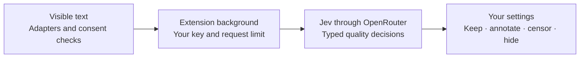

<p align="center">
  
</p>

<p align="center">
  <strong>An open-source browser extension that makes room for worthwhile content.</strong><br />
  Filter AI filler, clickbait, spam, and content-farm results. Keep the good stuff.<br />
  <strong>Developer preview. Bring your own key. Build it with us.</strong>
</p>

<p align="center">
  <a href="LICENSE"></a>
  <a href="https://github.com/juztripper/no-slop/releases/tag/v0.2.0"></a>
  <a href="https://github.com/juztripper/no-slop/actions/workflows/ci.yml"></a>
  
  
  <a href="https://github.com/juztripper/no-slop/blob/main/CONTRIBUTING.md"></a>
</p>

<p align="center">
  <a href="https://github.com/juztripper/no-slop/releases/tag/v0.2.0">Download preview</a> · <a href="#get-started">Get started</a> · <a href="docs/DEPLOYMENT.md">Bring your own key</a> · <a href="CONTRIBUTING.md">Contribute</a>
</p>

**We are looking for contributors.** Help make site adapters reliable, catch false positives, add multilingual examples, or improve accessibility. The interface preview and deterministic tests need no API key. [Choose a first contribution →](CONTRIBUTING.md)

**Developer preview · 0.2.0.** Use your own OpenRouter key directly in the extension. No separate server, Node.js, or running terminal is needed to use the extension ZIP. Provider usage is billed to your account; the project supplies no shared key or credits. A self-hosted detector remains optional. See [0.2.0 notes](docs/releases/0.2.0.md) and the [verification record](docs/VERIFICATION.md).

## Your feed, with a higher standard

The internet still contains thoughtful writing, patient tutorials, useful replies, and things made with care. NO SLOP helps those things get through.

- **Two independent filters.** Poorly generated AI content and classic low-quality content, such as spam and content farms. AI use by itself is not a reason to filter.
- **Censor or hide.** Censor softly blurs the original content, with a small stamp and reveal control that adapt to the result's size and light or dark surface. Hide closes the space it occupied. Restore the whole page from the popup.
- **Context stays intact.** Paragraphs and discussions with dependent replies get a quality note instead of having their meaning removed.
- **Your thresholds, your exceptions.** Choose filter strength, enable individual sites, and pause a domain. Optional self-hosted mode can also inspect public search destinations.
- **A small amount of motion.** A stamp settles in; a hidden result gently leaves. Disable animation at any time. System reduced-motion settings take precedence.
- **Text-only detection.** Jev makes typed decisions through OpenRouter using titles, captions, snippets and context. Images are not fetched or analyzed.

<p align="center"></p>

## Get started

For the [**0.2.0 extension ZIP**](https://github.com/juztripper/no-slop/releases/download/v0.2.0/no-slop-0.2.0-chromium.zip), you need Chrome or Edge and your own [OpenRouter key](https://openrouter.ai/settings/keys) with provider credits. No separate server is required.

1. Extract the ZIP into a permanent folder. Open `chrome://extensions` or `edge://extensions`, enable **Developer mode**, choose **Load unpacked**, and select that folder.
2. Open NO SLOP's settings → **Privacy & connection**. Choose **OpenRouter** and paste your own key. Set a dollar spending limit on that key in OpenRouter.
3. Choose **Save connection**, then **Check connection**. This checks key authentication without making a paid model request. Set your daily request limit; the default is **100 requests**, resetting at midnight UTC.
4. Review the data-sharing notice, consent, and enable analysis. Refresh feed tabs that were already open.

The daily request limit is a local call cap, **not a dollar spending limit**. The key stays in device-local extension storage, restricted to trusted extension pages and the background worker. It is not synced or exposed to page scripts, but it is not an encrypted vault. [Privacy details](PRIVACY.md) · [Setup and troubleshooting](docs/DEPLOYMENT.md).

**Upgrading from 0.1.0?** Existing installations keep their self-hosted detector and settings. Choose **OpenRouter**, save your own key, and consent again to switch. Keep the extension in the same folder when updating, reload it from the extensions page, then refresh feed tabs. [Historical 0.1.0 instructions](docs/releases/0.1.0.md) remain available.

### Contribute from source

Source development needs **Node.js 24+** and npm. The interface preview, build, and deterministic tests need no key.

```sh
git clone https://github.com/juztripper/no-slop.git
cd no-slop
npm ci
npm run build
```

Load the generated `dist/` directory as an unpacked extension, then follow the setup above. For interface work:

```sh
npm run dev
# http://127.0.0.1:5173 — settings and a clearly labeled interactive demo
npm run check
```

The demo uses pre-labeled examples and makes no provider calls. [Optional self-hosted setup](docs/DEPLOYMENT.md#optional-self-hosted-detector) covers local Node.js, Docker, HTTPS, service tokens and destination inspection.

## Site support

| Surface | What is inspected | What is filtered |
| --- | --- | --- |
| YouTube | Titles, available description snippets and comment text | Recognized video/Shorts cards, community posts and comments |
| Google Search | Search previews; optional public destination HTML in self-hosted mode | Complete recognized organic result cards |
| Instagram / Facebook / X | Visible captions, posts, comments and available context | Recognized whole post or comment containers |
| TikTok | Captions and comments | Recognized video and comment cards |
| Reddit / forums | Posts, replies and public discussion context | Whole independent items; annotations where replies depend on them |
| Other websites | Semantic article/list items and longer paragraphs | Independent content cards or non-destructive paragraph notes |

Adapters cover specific markup, not a promise that every layout or account variation works. Unknown layouts are left alone. Images are ignored and video/audio playback is not transcribed. Claims appearing only inside a thumbnail cannot affect the decision. Private messaging and known sensitive surfaces are excluded, but no generic extension can recognize every private page. Use domain exceptions for sensitive sites.

## How it works



The content script identifies bounded items and watches visible, newly loaded content. The background validates requests, checks consent and exceptions, and calls OpenRouter using your key. Shared policy validates Jev's typed answers and applies your filtering choices. Direct mode uses visible text, titles, captions, snippets and available context. It does not open links or fetch destination pages or images.

Unknown authorship is not invented. When quality is clearly poor but origin is unclear, filtering applies only when both categories are enabled. Uncertain quality stays visible. Reasons describe rubric signals; they are not fabricated model reasoning.

The background reserves paid calls against a persistent daily request limit and caches bounded hashed-key verdicts without storing raw text. Model output is data, never executable code. An optional self-hosted detector can add public destination text with DNS and redirect safeguards; a failed fetch is never a quality signal. [Architecture](docs/ARCHITECTURE.md) · [Detector and evaluation](docs/DETECTOR.md).

## Quality is measured, not declared

```sh
npm run check       # types, deterministic tests, extension + server builds
npm run eval:text            # 40 authored text contrasts; paid Jev calls
npm run eval:live            # original development corpus; paid Jev calls
npm run eval:holdout         # separate follow-up set; also uses paid provider calls
```

Live evaluation results are committed in [`docs/evaluations/`](docs/evaluations/). These are small development examples, not a representative benchmark or an AI-authorship test. False positives matter: a tool that removes good work has failed its purpose. Contributions should expand the evaluation set across languages and real, consented examples, with clear labels and counterexamples.

## Build this with us

The most useful contributions are often small: a changed selector, a false positive, a better translated example, or a keyboard interaction that could be clearer.

Read [CONTRIBUTING.md](CONTRIBUTING.md), then open a focused issue or pull request. [Report broken behavior](https://github.com/juztripper/no-slop/issues/new?template=bug.yml), [improve a detection](https://github.com/juztripper/no-slop/issues/new?template=detection.yml), or [browse first contributions](https://github.com/juztripper/no-slop/issues?q=is%3Aissue%20is%3Aopen%20label%3A%22good%20first%20issue%22). Maintainer help is welcome as the project grows. If the project is useful to you, a star helps others find it.

| Area | Start here |
| --- | --- |
| Website adapters and context preservation | `src/content/` |
| Filtering policy, schemas and privacy guards | `src/shared/` |
| Popup, settings and interactive demo | `src/ui/` |
| Direct OpenRouter processing and secure browser transport | `src/background/` |
| Optional self-hosted detector and destination inspection | `server/` |
| Regressions and live evaluation | `tests/`, `scripts/evaluate-text.ts` |

## Privacy and license

Analysis is opt-in and uses your own provider account, either directly or through your chosen self-hosted detector. Selected text goes to OpenRouter and Jev for inference; this is not offline detection. Read the [privacy document](PRIVACY.md) before enabling it. For vulnerabilities, read [SECURITY.md](SECURITY.md).

NO SLOP is licensed under [AGPL-3.0-only](LICENSE). Modified network-hosted versions must meet the license's source-sharing requirements. Jev is an external service with its own terms; it is not bundled or relicensed by this project.

The interface uses [Radix Themes](https://www.radix-ui.com/themes) and locally packaged [Inter](https://rsms.me/inter/). Their MIT and SIL Open Font licenses are included in [`public/licenses/`](public/licenses/) and the extension build. See the [design guide](docs/DESIGN.md) for interface conventions.

Built with [TypeSafe Jev](https://docs.typesafe.ai/concepts/system-one), [OpenRouter](https://openrouter.ai/~typesafe/jev-latest), TypeScript, React, and Manifest V3.
